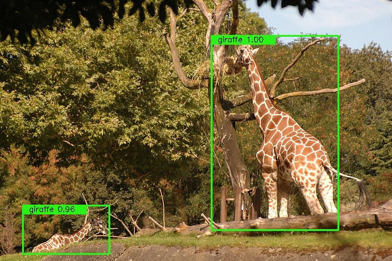
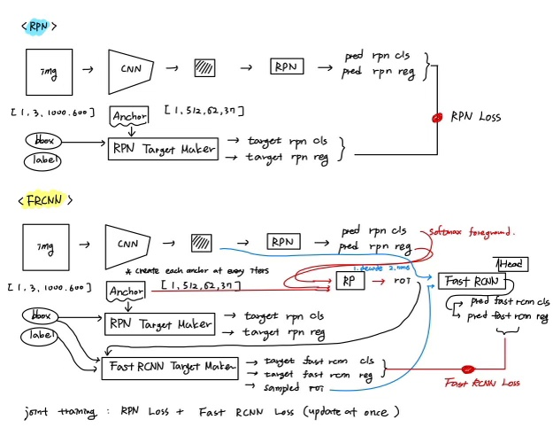

# Faster RCNN Pytorch 

re-implementation of faster rcnn (NIPS2015)

Please refer to https://arxiv.org/abs/1506.01497

### data set
- [x] VOC  
- [x] COCO

### data augmentation (for implementation of original paper)
- [x] Resize
- [x] Horizontal Flip

### TRAINING

- **Use approximate joint training**
- optimizer : SGD
- epoch : 12 x 9 + 2 = 110 
- initial learning rate : 0.01
- lr scheduler : cosine annealing (to 5e-4)
- weight decay : 5e-4
- momentum : 0.9

### RESULTS

#### 1. qualitative result

VOC

|methods     |  Traning   |   Testing  | Resolution |   AP50          |
|------------|------------|------------|------------| --------------- |
|papers      |2007        |  2007      | **         |   69.9          |
|papers      |2007 + 2012 |  2007      | **         |   73.2          |
|this repo   |2007        |  2007      | **         |   71.00(+1.10)  |
|this repo   |2007 + 2012 |  2007      | **         |   75.81(+2.61)  |

COCO

|methods     |  Traning    |   Testing  | Resolution |   mAP@[.5 .95]  |
|------------|-------------|------------|------------| --------------- |
|papers      |train        |  COCOval   | **         |   21.2          |
|papers      |trainval     |  COCOval   | **         |   -             |
|this repo   |COCOtrain2017|  minival   | **         |   20.7(-0.50%)  |

```
 Average Precision  (AP) @[ IoU=0.50:0.95 | area=   all | maxDets=100 ] = 0.207
 Average Precision  (AP) @[ IoU=0.50      | area=   all | maxDets=100 ] = 0.387
 Average Precision  (AP) @[ IoU=0.75      | area=   all | maxDets=100 ] = 0.199
 Average Precision  (AP) @[ IoU=0.50:0.95 | area= small | maxDets=100 ] = 0.039
 Average Precision  (AP) @[ IoU=0.50:0.95 | area=medium | maxDets=100 ] = 0.237
 Average Precision  (AP) @[ IoU=0.50:0.95 | area= large | maxDets=100 ] = 0.352
 Average Recall     (AR) @[ IoU=0.50:0.95 | area=   all | maxDets=  1 ] = 0.209
 Average Recall     (AR) @[ IoU=0.50:0.95 | area=   all | maxDets= 10 ] = 0.294
 Average Recall     (AR) @[ IoU=0.50:0.95 | area=   all | maxDets=100 ] = 0.298
 Average Recall     (AR) @[ IoU=0.50:0.95 | area= small | maxDets=100 ] = 0.055
 Average Recall     (AR) @[ IoU=0.50:0.95 | area=medium | maxDets=100 ] = 0.354
 Average Recall     (AR) @[ IoU=0.50:0.95 | area= large | maxDets=100 ] = 0.510
```

** A way to resize frcnn is to make the image different size if the original image is different.

#### 2. quantitative result

VOC


COCO




### Quick Start for test

1 - download pth.tar files 

- VOC
- faster_rcnn_voc.best.pth.tar [here](https://livecauac-my.sharepoint.com/:u:/g/personal/csm8167_cau_ac_kr/EaOuSelMyTJKin5B5C2k8D4BzXIC9Ej62CArAUXrpk9Hgg) (about 1GB)
- COCO
- faster_rcnn_coco.best.pth.tar [here](https://livecauac-my.sharepoint.com/:u:/g/personal/csm8167_cau_ac_kr/Efu3JLCm7RFNgGzRp-dNzYABWsFh-VrCUUCQ-rGNfbTk7A) (about 1GB)

2 - put tar file in like this (in saves)

```
dataset
evaluation
figures
logs
    |-- faster_rcnn_voc
        |-- saves
            |-- faster_rcnn_voc.best.pth.tar    
    |-- faster_rcnn_coco
        |-- saves
            |-- faster_rcnn_coco.best.pth.tar
anchor.py
...
main.py
...
utils.py
```

3 - set root and run test.py
```
test.py --name faster_rcnn_voc --root your own root --data_type voc
test.py --name faster_rcnn_coco --root your own root --data_type coco
```

### Update FRCNN (for implementation of original paper)
- [x] Model - Resnet DC5
- [x] Loss  - gIoU Loss
- [ ] Data  - Random crop (DETR)
- [ ] Train - Train schedule x9 

### Process of faster rcnn



### citation
If you found this implementation and pretrained model helpful, please consider citation
```
@misc{csm-kr_Faster_RCNN_Pytorch,
  author={Sungmin, Cho},
  publisher = {GitHub},
  title={Faster_RCNN_Pytorch},
  url={https://github.com/csm-kr/Faster_RCNN_Pytorch//},
  year={2022},
}
```
