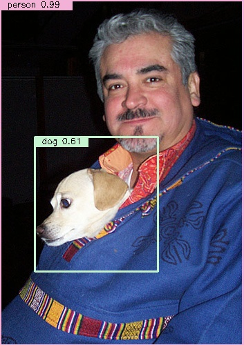
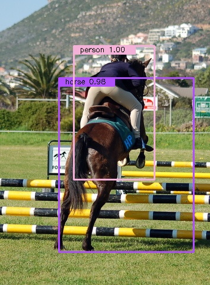
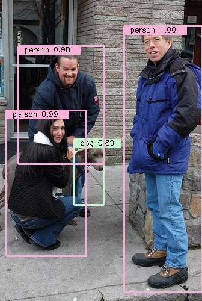

# Faster RCNN Pytorch 

re-implementation of faster rcnn (NIPS2015)

Please refer to https://arxiv.org/abs/1506.01497

### data set
- [x] VOC  
- [ ] COCO

### data augmentation (for implementation of original paper)
- [x] Resize
- [x] Horizontal Flip

### TRAINING

- **Use approximate joint training**
- optimizer : SGD
- epoch : 14 
- initial learning rate 0.001
- weight decay : 5e-4
- momentum : 0.9

### RESULTS

#### 1. qualitative result

VOC

|methods     |  Traning   |   Testing  | Resolution |   AP50          |
|------------|------------|------------|------------| --------------- |
|papers      |2007        |  2007      | **         |   69.9          |
|papers      |2007 + 2012 |  2007      | **         |   73.2          |
|this repo   |2007        |  2007      | **         |   71.0 (+1.1)   |
|this repo   |2007 + 2012 |  2007      | **         |      _          |

** A way to resize frcnn is to make the image different size if the original image is different.

#### 2. quantitative result

